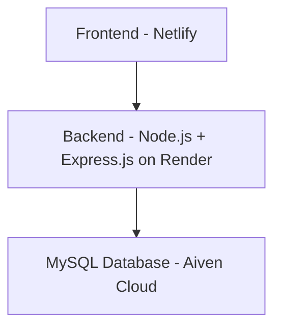

# 🏥Vatsalya – AI-Enabled Healthcare & Emergency Assistance Platform


Vatsalya is a cloud-hosted, AI-powered healthcare platform that provides instant medical guidance, intelligent hospital recommendations, first-aid assistance, and emergency support through an intuitive and user-friendly interface.

The platform bridges the gap between patients and healthcare services by enabling:

- 🏥 Smart hospital discovery with advanced filters
- 🤖 AI-powered symptom analysis and medical guidance
- 🚑 Emergency contacts and first-aid assistance
- 📍 Healthcare accessibility and navigation support
- 🎙️ Voice-assisted interaction for improved usability

Built with the vision of making healthcare information more accessible, reliable, and readily available during both routine and emergency situations.

---

## 🚀 Live Deployment

### Frontend

https://teal-rugelach-a777f3.netlify.app/

### Backend API

https://vatsalya-ai-healthcare-platform.onrender.com

### Hospitals API

https://vatsalya-ai-healthcare-platform.onrender.com/api/hospitals

---

## ✨ Key Features

* 🏥 Hospital recommendation system
* 🚑 Emergency healthcare assistance
* 🩺 First-aid guidance support
* 🤖 AI-powered healthcare interaction
* 🎙️ Voice-enabled assistance
* 🗺️ Google Maps hospital navigation
* 👤 User health profile management
* 📍 Location-based healthcare services
* 📊 Cloud-hosted hospital database
* 📱 Fully responsive design

---

## 🎯 Project Highlights

- Developed a full-stack healthcare assistance platform with cloud deployment.
- Built REST APIs using Node.js and Express.js for healthcare data retrieval.
- Integrated MySQL cloud database for hospital information management.
- Implemented responsive UI with healthcare accessibility features.
- Deployed frontend and backend using modern cloud hosting services.

---


## 🛠️ Technology Stack

### Frontend

* HTML5
* CSS3
* JavaScript

### Backend

* Node.js
* Express.js

### Database

* MySQL (Aiven Cloud)

### Deployment

* Netlify (Frontend Hosting)
* Render (Backend Hosting)
* Aiven Cloud (Database)

### Development Tools

* Git
* GitHub
* VS Code

---

## 🏗️ System Architecture


---

## 📂 Project Structure

```text
Vatsalya-AI-Healthcare-Platform/
├── Backend/
│   ├── server.js
│   ├── db.js
│   ├── package.json
│   └── package-lock.json
│
├── Frontend/
│   ├── index.html
│   ├── script.js
│   └── style.css
│
└── README.md
```

## ⚙️ Installation & Setup

### Clone Repository

```bash
git clone https://github.com/Vanshikamishra395/Vatsalya-AI-Healthcare-Platform.git
```

### Backend Setup

```bash
cd Backend
npm install
node server.js
```

### Local API

```text
http://localhost:5000/api/hospitals
```

---

## 📊 Current Functionality

* Hospital database management
* Hospital information retrieval APIs
* Emergency healthcare information
* Frontend-backend integration
* Cloud database connectivity
* Live deployment infrastructure

---

## 🔮 Future Enhancements

* AI symptom analysis engine
* Nearby hospital recommendations
* Ambulance booking integration
* Emergency SOS system
* User authentication
* Digital health records
* Ayushman Bharat integration
* CGHS integration
* Telemedicine support
* Multilingual healthcare assistant

---

## 📸 Screenshots

* Home Page
  

* Hospital Recommendation Page
  

* Emergency Assistance Section
  

---

## 📚 Key Learnings

- Full-stack web application development
- REST API design and implementation
- Cloud deployment using Netlify and Render
- Database connectivity and management with MySQL
- Git and GitHub version control workflows
- Frontend-backend integration
- Debugging deployment and production issues

---


## 📄 License

This project is developed for educational and learning purposes.

---

## 📌 Project Status

🟢 Active Development

Continuously improving healthcare accessibility through technology.
